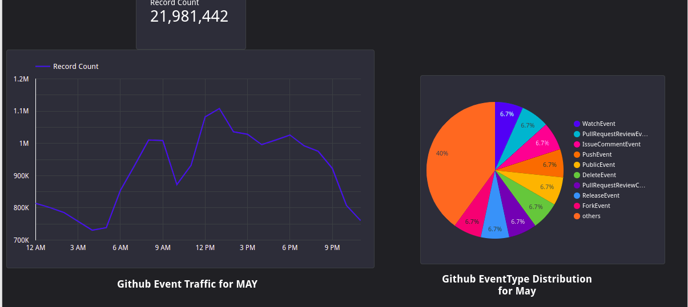
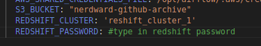
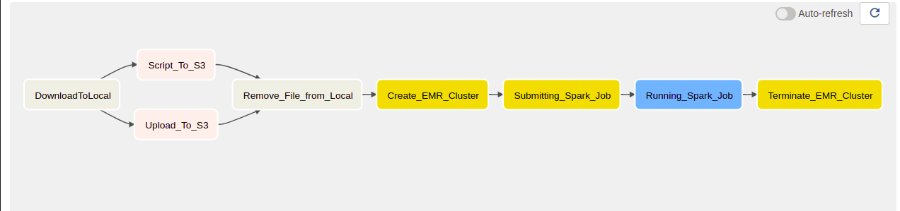

### Problem statement

The Research and Development Team of Github want to know what time of the day
they get more traffic and what resources are not popular enough. They will 
send details to the Marketing Team.

* You have been hired to give insights on Github Developer activity for June 2022.
* Here are some visualizations you need to produce:
  * Traffic per hour
  * Events popularity chart.

### About the Dataset
[GitHub Archive](https://www.gharchive.org/) is a project to record the public GitHub timeline, archive it, and make it easily accessible for further analysis

### Architecture
* Create a dashboard


## Data Pipeline 

The pipeline could be stream or batch: this is the first thing you'll need to decide 

* If you want to run things periodically (e.g. hourly/daily), go with batch


## Technologies / Tools
* Containerisation: [Docker](https://www.docker.com/)
* Cloud: [AWS](https://aws.amazon.com/)
* Infrastructure as code (IaC): [Terraform](https://www.terraform.io/)
* Workflow orchestration: [Airflow](https://airflow.apache.org/)
* Data Wareshouse: [Redshift](https://aws.amazon.com/redshift/)
* Batch processing: [EMR](https://aws.amazon.com/emr/)
* Visualisation: [Google Data Studio](https://datastudio.google.com/)

## About the Project
* Github Archive data is ingested daily into the AWS S3 buckets from 1st of May.
* A Spark job is run on the data stored in the S3 bucket using AWS ElasticMapReduce (EMR)
* The results are written to a table defined in Redshift.
* A dashboard is created from the Redshift tables. 

## Dashboard



## Reproducibility

### Prerequisites.

#### AWS Platform Account
1. Create an AWS account if you do not have one. AWS offers free tier for some services like S3, Redshift.

#### Create an IAM user (optional but advised)

1. Open the IAM console [here](https://console.aws.amazon.com/iam/)
2. In the navigation pane, choose Users and then choose Add users. More information [here](https://docs.aws.amazon.com/IAM/latest/UserGuide/id_users_create.html)
3. Select Programmatic access, For console password, create custom password.
4. On the Set permissions page, Attach AdministratorAccess policy.
5. Download credentials.csv file with login information and store it in `${HOME}/.aws/credentials.csv`

### Pre-Infrastructure Setup

Terraform is used to setup most of the services used for this project i.e S3 buckets, Redshift cluster. This section contains step to setup these aspects of the project.

#### Setting up a Virtual Machine
You can use any virtual machine of your choice; Azure, GCP etc..
But AWS EC2 is preferable because of faster upload and download speeds to AWS services.
To set up an AWS EC2 vm that works for this project, you will need to pay for it. Here is a [link](https://www.guru99.com/creating-amazon-ec2-instance.html) to help. Ubuntu OS is preferable.

#### AWS CLI
To download and set up AWS cli
```
curl "https://awscli.amazonaws.com/awscli-exe-linux-x86_64.zip" -o "awscliv2.zip"
unzip awscliv2.zip
sudo ./aws/install
```

#### AWS credentials
1. To configure aws credentials run 
```
$ aws configure
AWS Access Key ID [None]: fill with value from credentials.csv
AWS Secret Access Key [None]: fill with value from fill with value from credentials.csv
Default region name [None]: your regiion
Default output format [None]: json
```

##### Docker
1. Connect to your VM
2. Install Docker
    ```bash
    sudo apt-get update
    sudo apt-get install docker.io
    ```
3. Docker needs to be configured so that it can run without `sudo`
    ```bash
    sudo groupadd docker
    sudo gpasswd -a $USER docker
    sudo service docker restart
    ```
    - Logout of your SSH session and log back in
    - Test that docker works successfully by running `docker run hello-world`
##### Docker-Compose
1. Check and copy the latest release for Linux from the official Github [repository](https://github.com/docker/compose)
2. Create a folder called `bin/` in the home directory. Navigate into the `/bin` directory and download the binary file there
    ```bash
    wget <copied-file> -O docker-compose
    ```
3. Make the file executable 
    ```bash
    chmod +x docker-compose
    ```
4. Add the `.bin/` directory to PATH permanently
    - Open the `.bashrc` file in the HOME directory
    ```bash
    nano .bashrc
    ```
    - Go to the end of the file and paste this there 
    ```bash
    export PATH="${HOME}/bin:${PATH}"
    ```
    - Save the file (_CTRL-O_) and exit nano (_CTRL-X_)
    - Reload the PATH variable
    ```bash
    source .bashrc
    ```
5. You should be able to run docker-compose from anywhere now. Test this with `docker-compose --version`
##### Terraform
1. Navigate to the `bin/` directory that you created and run this
    ```bash
    wget https://releases.hashicorp.com/terraform/1.1.7/terraform_1.1.7_linux_amd64.zip
    ```
2. Unzip the file
    ```bash
    unzip terraform_1.1.7_linux_amd64.zip
    ```
    > You might have to install unzip `sudo apt-get install unzip`
3. Remove the zip file
    ```bash
    rm terraform_1.1.7_linux_amd64.zip
    ```
4. Terraform is already installed. Test it with `terraform -v`

##### Remote-SSH
To work with folders on a remote machine on Visual Studio Code, you need this extension. This extension also simplifies the forwarding of ports.
1. Install the Remote-SSH extension from the Extensions Marketplace
2. At the bottom left-hand corner, click the _Open a Remote Window_ icon
3. Click _Connect to Host_. Click the name of your config file host.
4. In the _Explorer_ tab, open any folder on your Virtual Machine
Now, you can use VSCode completely to run this project.

<p align="right"><a href="#index">back to index</a></p>

### Main

#### Clone the repository
```bash
    git clone https://github.com/Nerdward/batch_gh_archive
```
#### Create remaining infrastructure with Terraform
We use Terraform to create a S3 bucket and Redshift
1. Navigate to the [terraform](./terraform/) folder
2. Initialise terraform
    ```bash
    terraform init
    ```
3. Check infrastructure plan
    ```bash
    terraform plan
    ```
4. Create new infrastructure
    ```bash
    terraform apply
    ```
5. Confirm that the infrastructure has been created on the AWS console.
#### Initialise Airflow
Airflow is run in a docker container. This section contains steps on initisialing Airflow resources
1. Navigate to the [airflow](./airflow/) folder
2. Create a logs folder `airflow/logs/`
    ```bash
    mkdir logs/
    ```
3. Build the docker image
    ```bash
    docker-compose build
    ```
4. The names of some project resources are hardcoded in the [docker_compose.yaml](./airflow/docker-compose.yaml) file. Change this values to suit your use-case
    
5. Initialise Airflow resources
    ```bash
    docker-compose up airflow-init
    ```
6. Kick up all other services
    ```bash
    docker-compose up
    ```
7. Open another terminal instance and check docker running services
    ```bash
    docker ps
    ```
    - Check if all the services are healthy
8. Forward port **8080** from VS Code. Open `localhost:8080` on your browser and sign into airflow
    > Both username and password is `airflow`
#### Run the pipeline
You are already signed into Airflow. Now it's time to run the pipeline
1. Click on the DAG `Batch_Github_Archives` that you see there
2. You should see a tree-like structure of the DAG you're about to run
    
3. You can also check the graph structure of the DAG
    
4. At the top right-hand corner, trigger the DAG. Make sure _Auto-refresh_ is turned on before doing this
    > The DAG would run from May 1 at 12:00am UTC till May 7  
    > This should take a while
5. While this is going on, check the cloud console to confirm that everything is working accordingly
    > If you face any problem or error, confirm that you have followed all the above instructions religiously. If the problems still persist, raise an issue.
6. When the pipeline is finished and you've confirmed that everything went well, shut down **docker-compose* with _CTRL-C_ and kill all containers with `docker-compose down`
7. Take a well-deserved break to rest. This has been a long ride.

<p align="right"><a href="#index">back to index</a></p>


## Going the extra mile 

If you finish the project and you want to improve it, here are a few things you can do:

* Add tests
* Use make
* Add CI/CD pipeline 

This is not covered in the course and this is entirely optional.

If you plan to use this project as your portfolio project, it'll 
definitely help you to stand out from others.

> **Note**: this part will not be graded. 


Some links to refer to:

* [Unit Tests + CI for Airflow](https://www.astronomer.io/events/recaps/testing-airflow-to-bulletproof-your-code/)
* [CI/CD for Airflow (with Gitlab & GCP state file)](https://engineering.ripple.com/building-ci-cd-with-airflow-gitlab-and-terraform-in-gcp)
* [CI/CD for Airflow (with GitHub and S3 state file)](https://programmaticponderings.com/2021/12/14/devops-for-dataops-building-a-ci-cd-pipeline-for-apache-airflow-dags/)
* [CD for Terraform](https://towardsdatascience.com/git-actions-terraform-for-data-engineers-scientists-gcp-aws-azure-448dc7c60fcc)
* [Spark + Airflow](https://medium.com/doubtnut/github-actions-airflow-for-automating-your-spark-pipeline-c9dff32686b)
